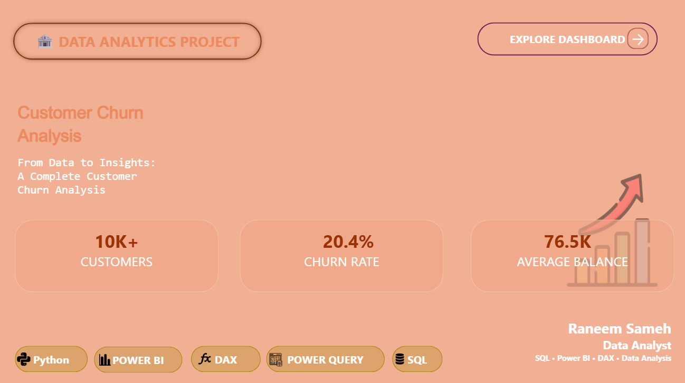
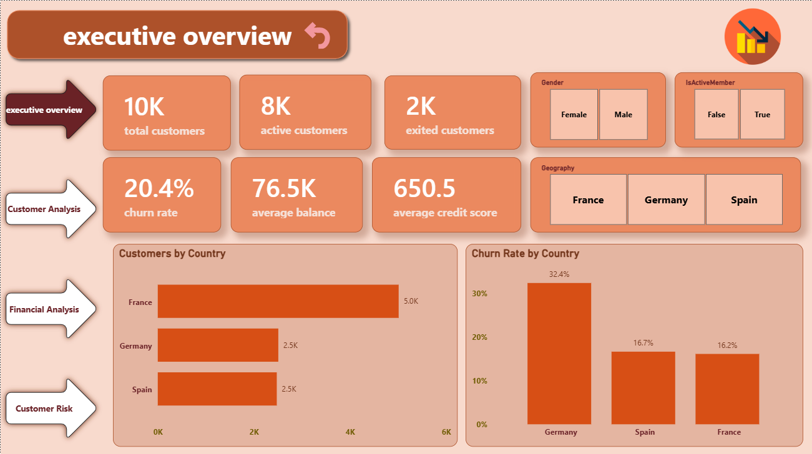
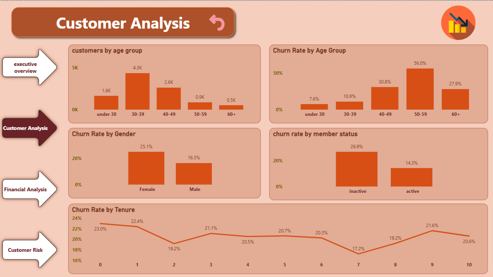
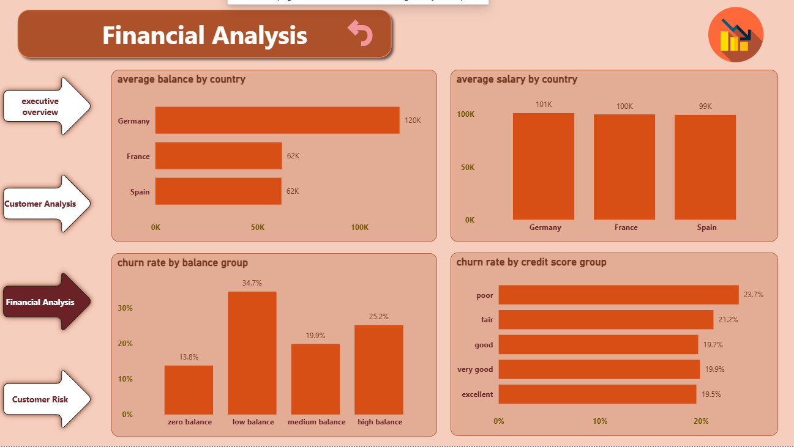
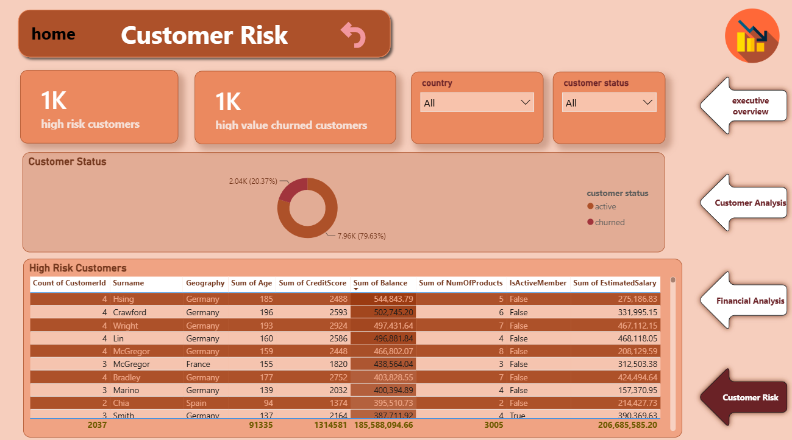

# 🏦 Bank Customer Churn Analysis

## 📌 Project Overview

This project analyzes bank customer churn to understand customer behavior and identify patterns associated with customer attrition.

The project was developed using **Python, SQL, and Power BI** to transform customer data into meaningful insights and interactive visualizations.

---

## 🎯 Objectives

- Analyze customer churn behavior
- Calculate the overall churn rate
- Identify high-churn customer segments
- Analyze churn by geography, gender, age, and tenure
- Analyze customer balance and credit score
- Analyze the relationship between customer characteristics and churn
- Create an interactive Power BI dashboard
- Provide actionable business insights

---


## 📸 Dashboard Preview

### Cover Page



### Executive Overview



### Customer Analysis



### Financial Analysis



### Customer Risk



## 🛠️ Tools & Technologies

- Python
- Pandas
- NumPy
- Matplotlib
- Seaborn
- SQL Server
- Power BI
- Power Query
- DAX

---

## 📊 Data Analysis

The project includes:

- Data exploration
- Data quality checks
- Missing value analysis
- Duplicate customer analysis
- Customer segmentation
- Churn rate analysis
- Geography analysis
- Gender analysis
- Age analysis
- Tenure analysis
- Balance analysis
- Credit score analysis
- Number of products analysis
- Active member analysis
- Correlation analysis

---

## 🐍 Python Analysis

Python was used for exploratory data analysis and visualization.

The analysis includes:

- Dataset inspection
- Missing value checks
- Duplicate checks
- Customer distribution
- Churn rate analysis
- Churn by geography
- Churn by gender
- Churn by age group
- Churn by tenure
- Churn by active member status
- Churn by number of products
- Churn by balance group
- Churn by credit score group
- Average balance by country
- Average salary by country
- Average age by customer status
- Average credit score by customer status
- Correlation analysis

---

## 🗄️ SQL Analysis

SQL Server was used to explore the dataset and perform business analysis.

The SQL analysis includes:

- Database creation
- Dataset preview
- Total number of customers
- Missing value checks
- Duplicate customer ID checks
- Available countries
- Available genders
- Churn values
- Minimum and maximum age
- Minimum and maximum balance
- Minimum and maximum salary
- Minimum and maximum credit score
- Customers by geography
- Customers by gender
- Customers by number of products
- Active member analysis
- Credit card analysis
- Balance statistics
- Salary statistics
- Credit score statistics
- Age distribution
- Tenure distribution

### Example SQL Query

```sql
select geography,
count(*) as total_customers
from churn_modelling
group by geography
order by total_customers desc;


## 📂 Project Structure

Bank-Customer-Churn/
│
├── data/
│
├── python/
│   └── churn_analysis.ipynb
│
├── sql/
│   └── churn_analysis.sql
│
├── powerbi/
│   └── bank_customer_churn.pbix
│
├── images/
│   ├── executive-overview.png
│   ├── customer-analysis.png
│   ├── financial-analysis.png
│   └── customer-risk.png
│
└── README.md

👩‍💻 Author
Raneem Sameh

Data Analyst

Skills:
Python | SQL | Power BI | Excel | DAX | Power Query | Data Analysis
